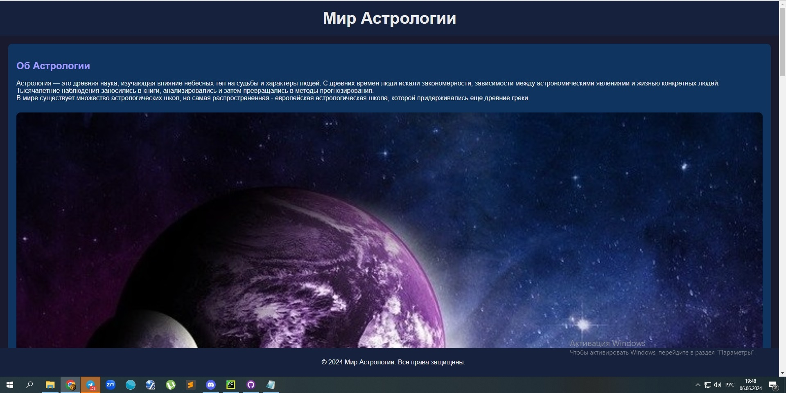

# Мир Астрологии

## Описание
Этот проект представляет собой простой веб-сайт, посвященный астрологии. Сайт включает три основные секции: об астрологии, виды астрологических прогнозов и известные астрологи. Оформление сайта выполнено в синих и фиолетовых тонах с иллюстрациями созвездий.

## Структура проекта
Проект состоит из двух основных файлов:
- `index.html`: Основная структура сайта.
- `styles.css`: Стили для оформления сайта.

## Содержимое
### Главная страница
Сайт состоит из следующих разделов:

1. **Об Астрологии**
    - Краткое описание астрологии как древней науки.
    - Иллюстрация созвездия.

2. **Астрологические Прогнозы**
    - Описание различных типов астрологических прогнозов (ежедневные, еженедельные, месячные, годовые).
    - Иллюстрация созвездия.

3. **Известные Астрологи**
    - Описание известных астрологов, таких как Нострадамус, Птолемей и Вильям Лилли.
    - Иллюстрация созвездия.

### Оформление
- Цветовая гамма сайта включает синие и фиолетовые тона.
- Каждая секция имеет фоновый цвет, соответствующий общей цветовой схеме сайта.
- Иллюстрации созвездий добавляют визуальный интерес и поддерживают тему сайта.

## Установка и использование
1. Склонируйте репозиторий:
    ```sh
    git clone https://github.com/username/astrology-site.git
    ```
2. Перейдите в директорию проекта:
    ```sh
    cd astrology-site
    ```
3. Откройте файл `astro.html` в вашем веб-браузере.

## Скриншоты
### Главная страница


## Авторы
- [Татьяна Пискунова](https://github.com/username)

## Лицензия
Этот проект лицензирован под лицензией MIT. Подробности см. в файле [LICENSE](LICENSE).
# lessone10
 
